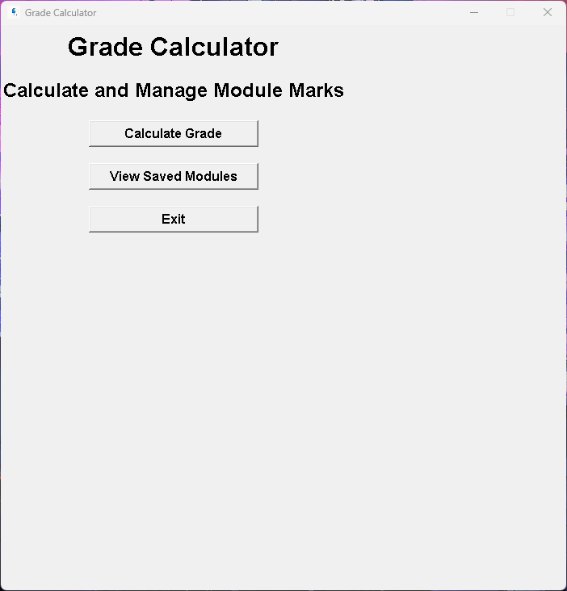
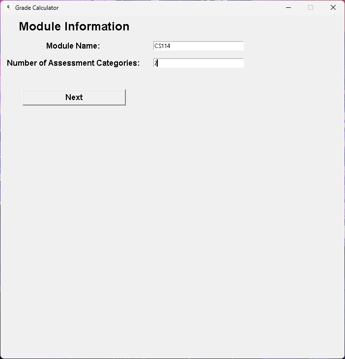
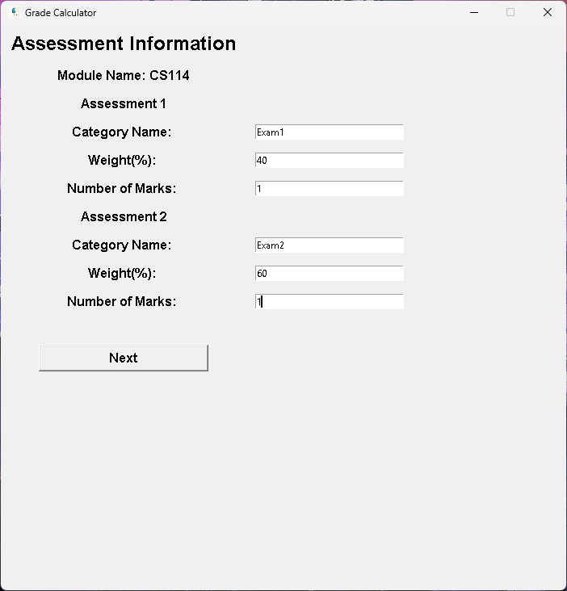
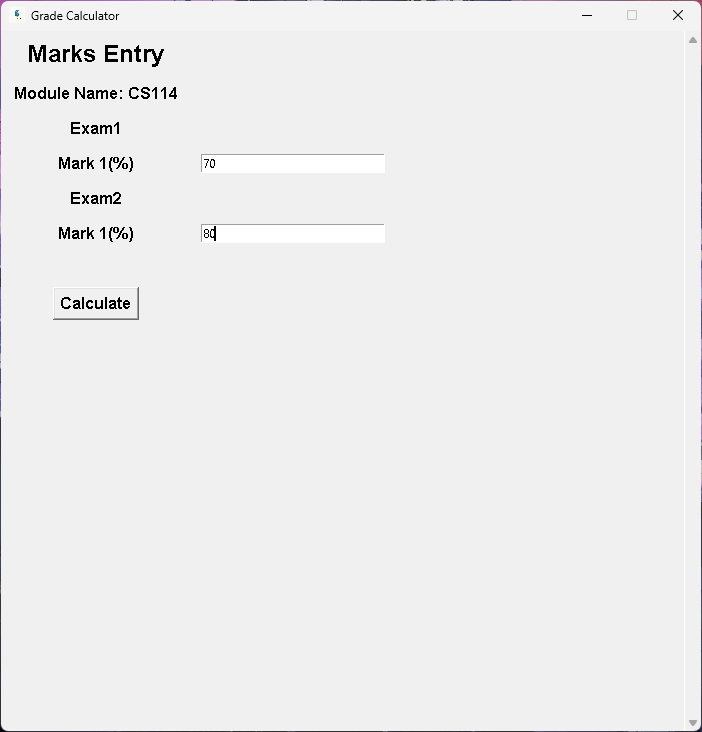
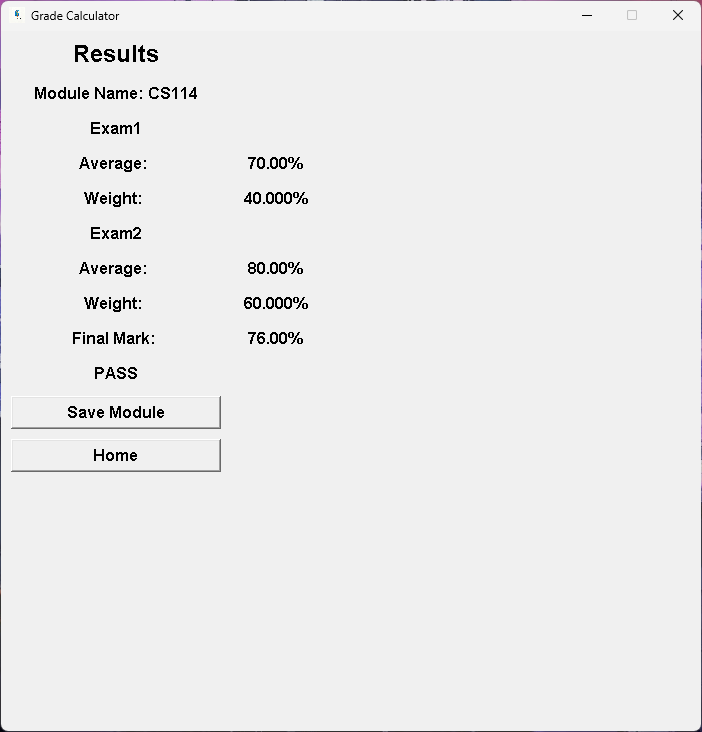
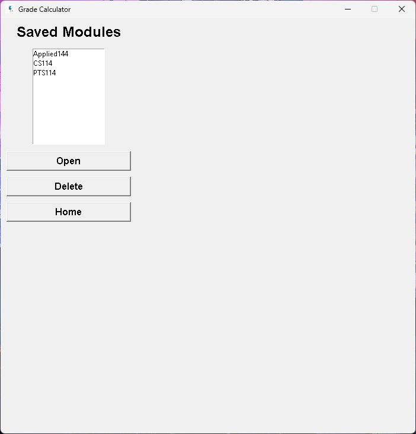

# Grade Calculator

A desktop application built with **Python** and **Tkinter** that allows students to calculate, manage, and save module grades using custom assessment categories and weightings.

The application provides an intuitive graphical interface where users can create assessment categories, enter marks, calculate weighted final grades, and save results for future reference.

---

## Features

- Graphical User Interface (Tkinter)
- Custom assessment category names
- Custom assessment weightings
- Multiple marks per assessment category
- Automatic category average calculation
- Automatic weighted final mark calculation
- Pass/Fail determination
- Save module results to individual text files
- View saved modules
- Open saved modules
- Delete saved modules
- Overwrite confirmation when saving existing modules
- Comprehensive input validation
- Scrollable marks entry screen for modules with many assessments

---

## Technologies Used

- Python 3
- Tkinter
- File Handling
- Exception Handling
- Modular Programming
- Git & GitHub

---

## Project Structure

```text
grade-calculator/
│
├── gui.py
├── marks.py
├── logo.png
├── modulemarks/
│   ├── CS114.txt
│   ├── PTS114.txt
│   └── ...
├── screenshots/
│   ├── home.png
│   ├── module-info.png
│   ├── assessment-info.png
│   ├── marks-entry.png
│   ├── results.png
│   └── saved-modules.png
└── README.md
```

---

## Screenshots

### Home Screen



### Module Information



### Assessment Information



### Marks Entry



### Results



### Saved Modules



---

## How to Run

1. Clone the repository.

```bash
git clone https://github.com/CharlesFortuin/grade-calculator.git
```

2. Navigate to the project directory.

```bash
cd grade-calculator
```

3. Run the application.

```bash
python gui.py
```

---

## Skills Demonstrated

This project demonstrates experience with:

- GUI development using Tkinter
- Modular software design
- User input validation
- Exception handling
- Dynamic widget creation
- File management
- Nested lists and data processing
- Separation of business logic from presentation
- Git branching and version control

---

## Future Improvements

Potential future enhancements include:

- Editing existing saved modules
- Exporting results to CSV
- GPA calculation across multiple modules
- Search functionality
- Data visualisation (graphs/charts)
- Dark mode

---

## Author

**Charles Fortuin**

BSc Computer Science  
Stellenbosch University

GitHub: https://github.com/CharlesFortuin